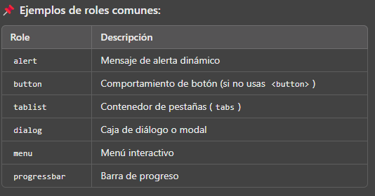

# ARIA (Accessible Rich Internet Applications)

# ♿ Accesibilidad en la Web con ARIA

**Accessible Rich Internet Applications (ARIA)** es un conjunto de atributos que hacen que las aplicaciones web sean más accesibles para personas con discapacidad.

## 📌 Principios básicos de ARIA

🔹 **Regla #1**:  
✅ **Si puedes, usa HTML semántico en lugar de ARIA**.  
Ejemplo correcto sin ARIA:

```html
<button>Menú</button>
```

❌ **Incorrecto si no es necesario:**

```html
<div role="button" tabindex="0">Menú</div>
```

> [!WARNING]
> ARIA solo debe usarse cuando no hay una alternativa semántica en HTML.

## 🎭 `role` (Roles ARIA)

El atributo `role` define el propósito de un elemento. Útil cuando no hay una etiqueta HTML semántica adecuada.

```html
<div role="tablist" aria-label="Sample Tabs">
  <div role="tab">Tab 1</div>
  <div role="tab">Tab 2</div>
</div>
```



## `aria-label` (Etiqueta personalizada)

Etiqueta un elemento interactivo con una cadena de texto personalizada.

```HTML
<button aria-label="Abrir menú de configuración">⚙</button>
```

## `aria-labelledby` (Etiqueta desde otro elemento)

Permite que un elemento obtenga su descripción de otro ID existente.

```html
<h2 id="form-title">Registro</h2>
<form aria-labelledby="form-title">
  <input type="text" placeholder="Nombre" />
</form>
```

Diferencia con aria-label:

- aria-label usa una cadena personalizada.
- aria-labelledby usa texto visible en la página.

## `aria-expanded` (Estado de expansión)

Indica si un elemento interactivo (ejemplo: menú o acordeón) está abierto (true) o cerrado (false).

```html
<button aria-expanded="false" aria-controls="menu">Menú</button>
<ul id="menu" hidden>
  <li>Opción 1</li>
  <li>Opción 2</li>
</ul>
```

Si el elemento controla otro, usa aria-controls para vincularlos.

## `aria-controls` (Asocia elementos)`

Indica qué elemento está controlado por otro, ideal para menús y modales.

```html
<button aria-controls="content" aria-expanded="false">Mostrar</button>
<div id="content" hidden>Contenido oculto</div>
```

## Ejemplo Completo de Menú Accesible

```html
<nav aria-label="Menú principal">
  <button id="menu-btn" aria-expanded="false" aria-controls="menu-list">
    ☰ Menú
  </button>
  <ul id="menu-list" hidden>
    <li><a href="#">Inicio</a></li>
    <li><a href="#">Servicios</a></li>
    <li><a href="#">Contacto</a></li>
  </ul>
</nav>
```

```html
<div class="spinner" role="status" aria-live="polite" aria-label="Cargando">
  <span class="visually-hidden"> cargando ... </span>
</div>
```
