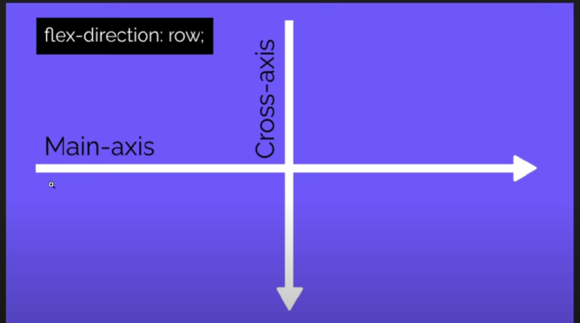
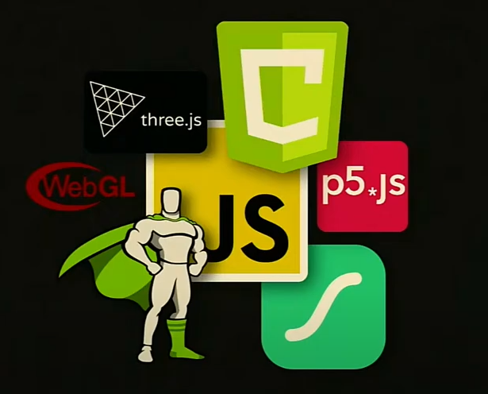
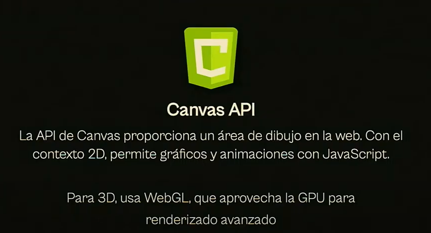
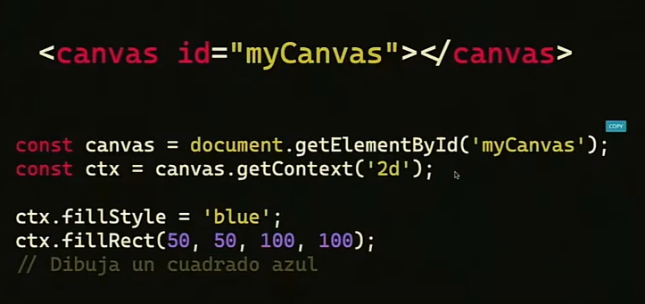
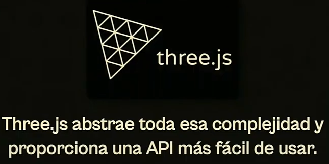
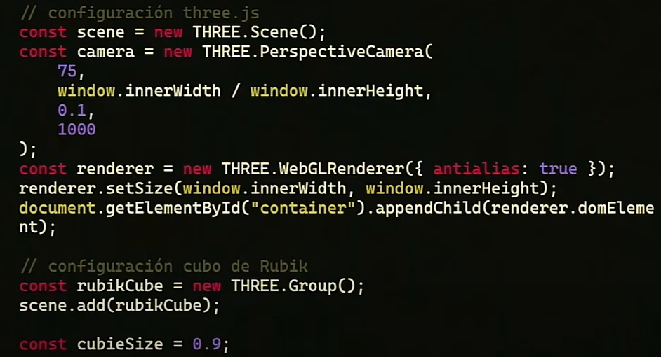
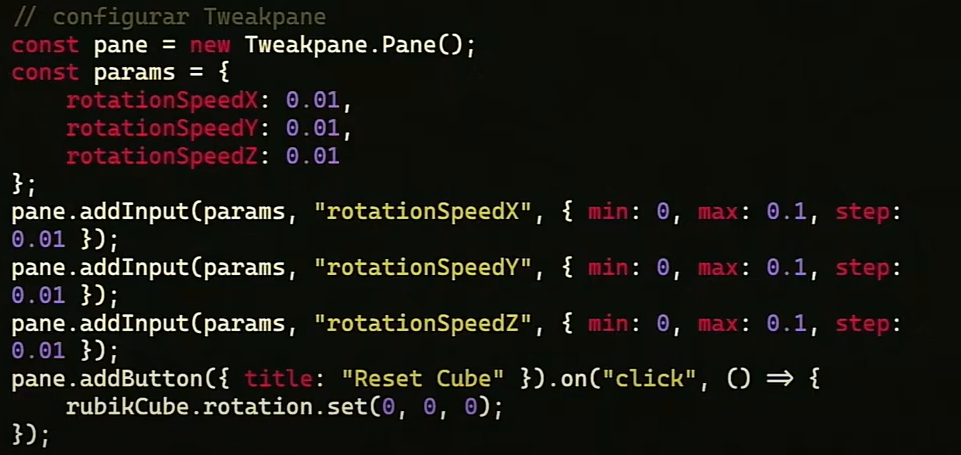

# 🎨 ¿Qué es CSS?

## 📌 Definición

**CSS (Cascading Style Sheets)** es un lenguaje de estilos que se usa para controlar la apariencia y el diseño de las páginas web.

## 🏗️ ¿Para qué sirve?

- Definir colores, fuentes y espacios.
- Crear diseños responsivos.
- Aplicar animaciones y transiciones.
- Mejorar la accesibilidad y la experiencia del usuario.

## 🛠️ Ejemplo básico

```html
<!DOCTYPE html>
<html lang="es">
  <head>
    <meta charset="UTF-8" />
    <title>Ejemplo CSS</title>
    <style>
      body {
        background-color: lightblue;
        font-family: Arial, sans-serif;
      }

      h1 {
        color: navy;
        text-align: center;
      }
    </style>
  </head>
  <body>
    <h1>¡Hola, CSS!</h1>
  </body>
</html>
```

# axis



# Tipos de CSS

1. Inline CSS (Dentro del HTML)

```html
<p style="color: red;">Texto rojo</p>
```

2. CSS Interno `(Dentro de <style> en el HTML)`

3. CSS Externo `(Archivo .css enlazado con <link>)`

## Conceptos clave

- `Selectores`: Elementos a los que aplicamos estilos.
- `Propiedades`: Características como color, tamaño, margen, etc.
- `Valores`: Especifican cómo se aplica la propiedad.

# animaciones con js






**esto dibuja en 2d**

tienes funcionalidades:

- Usa shaders (GPU Pixeles)
- (x, y, z)
-  ILUMINACIÓN
- sombras
- materiales



## animacion con three js





