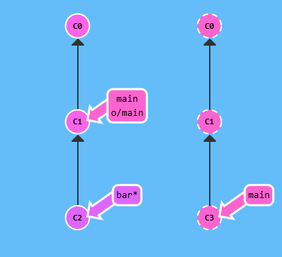
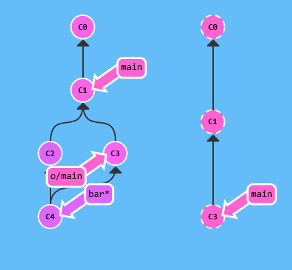
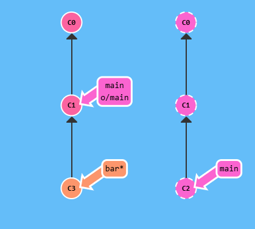
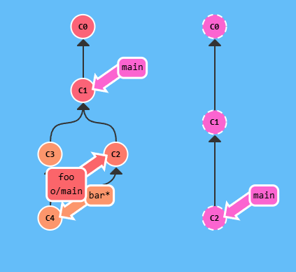

# Params push

`<remoto><lugar>`

`git push origin main`

> [!IMPORTANT]
> para especificar tanto el origen como el lugar, simplemente unelos usando el signo:

```bash
git push origin <origen>:<destino>
```

Ejemplo: `git fetch origin foo`

# Rarezas del origin

- Git abusa del parámetro origin
- Puedes especificar "la nada" como un origin
- `git push origin :side`
- `git fetch origin :bugfix`

> [!NOTE]
> Push de nada a una rama remota la elimina

> [!NOTE]
> Fetch de nada a un lugar local crea una nueva rama

> [!IMPORTANT]
> `git pull origin foo` = `git fetch origin foo` + `git merge o/foo`

> [!IMPORTANT]
> `git pull origin bar:bugfix` = `git fetch origin bar:bugfix` + `git merge bugfix`

## Demostración

Si especificamos el lugar desde donde hacer fetch, todo ocurre como antes, pero sólo mergeamos lo que se fetcheó.

`git pull origin main`



y pasa

¡Ves! Especificando main descargamos los commits a o/main como siempre. Después mergeamos o/main a nuestra rama actual, sin importar qué había en nuestra copia de trabajo.



## ¿Esto funciona con origen y destino, también? ¡Más vale! Veámoslo:



aplicaremos un git pull origin main:foo

Caramba, eso es una BARBARIDAD en un único comando. Creamos una nueva rama local llamada foo, descargamos los commits del main del remoto a esta rama foo, y después mezclamos esa rama a nuestra rama actual bar. ¡¡¡Supera los 9000!!!


