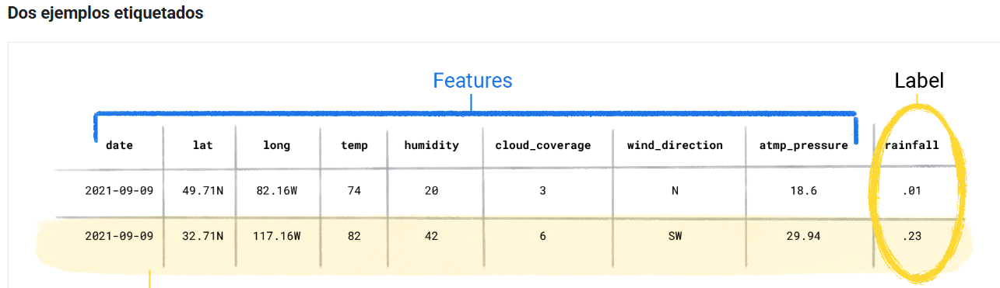
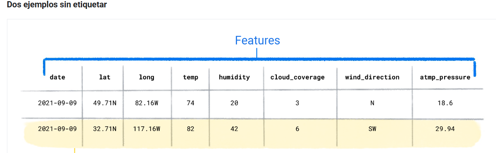
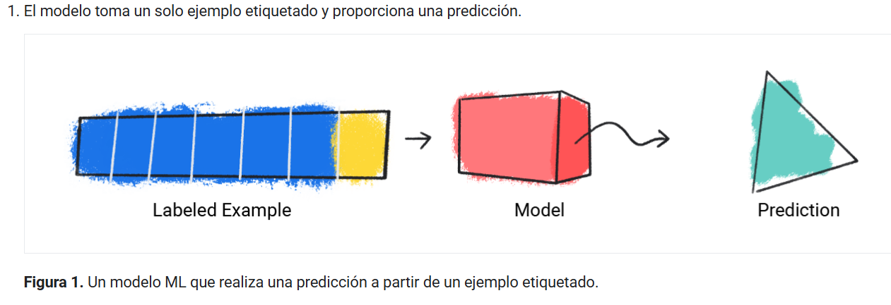
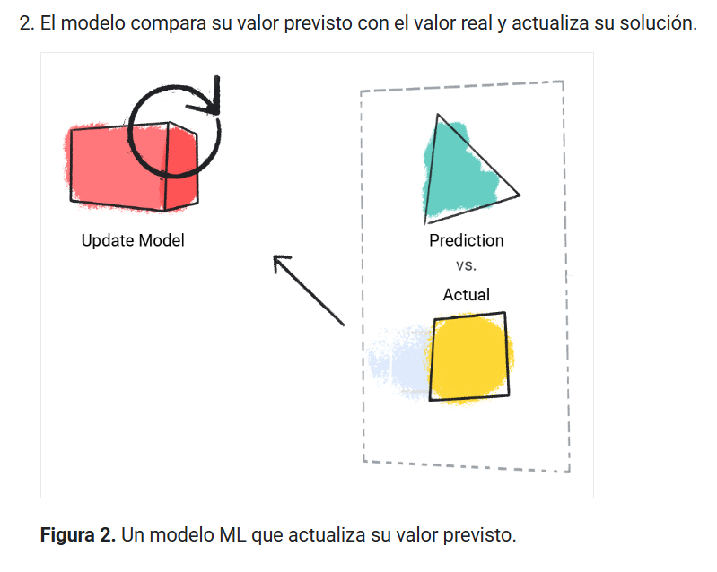
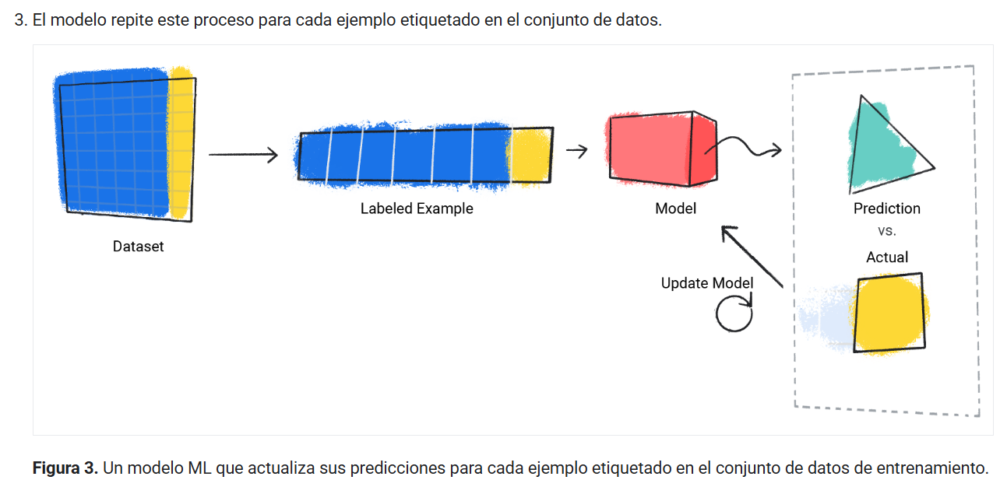
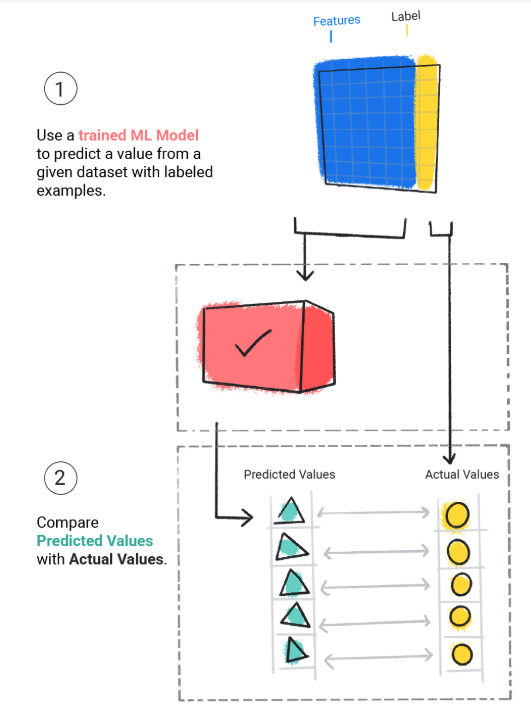

# Introducción al aprendizaje automático

Obj:

- Comprender los diferentes tipos de aprendizaje automático
- Comprender los conceptos clave del aprendizaje automático supervisado
- Aprende cómo resolver problemas con el AA es diferente de los enfoques tradicionales.

El aprendizaje automático (AA) potencia algunas de las tecnologías más importantes que usamos, desde las apps de traducción hasta los vehículos autónomos. En este curso, se explican los conceptos básicos de la AA.

El AA ofrece una nueva forma de resolver problemas, responder preguntas complejas y crear contenido nuevo. El AA puede predecir el clima, estimar los tiempos de viaje, recomendar canciones, autocompletar oraciones, resumir artículos y generar imágenes nunca antes vistas.

En términos básicos, el AA es el proceso de entrenar un software, llamado modelo, para hacer predicciones útiles o generar contenido a partir de datos.

Por ejemplo, supongamos que queremos crear una app para predecir la lluvia. Podríamos usar un enfoque tradicional o uno de AA. Con un enfoque tradicional, crearemos una representación basada en la física de la atmósfera y la superficie de la Tierra, y calcularemos grandes cantidades de ecuaciones de dinámica de fluidos. Esto es increíblemente difícil.

Con un enfoque de AA, le daríamos a un modelo de AA enormes cantidades de datos climáticos hasta que, finalmente, el modelo de AA aprendiera la relación matemática entre los patrones climáticos que producen diferentes cantidades de lluvia. Luego, le daríamos al modelo los datos del clima actuales, y este predeciría la cantidad de lluvia.

Tipos de sistemas de AA
Los sistemas de AA se dividen en una o más de las siguientes categorías según cómo aprenden a realizar predicciones o generar contenido:

- Aprendizaje supervisado
- Aprendizaje no supervisado
- Aprendizaje por refuerzo
- IA generativa

# Aprendizaje supervisado

Los modelos de aprendizaje supervisado pueden realizar predicciones después de ver muchos datos con las respuestas correctas y, luego, descubrir las conexiones entre los elementos de los datos que producen las respuestas correctas. Esto es como un estudiante que aprende material nuevo estudiando exámenes anteriores que contienen preguntas y respuestas. Una vez que el estudiante se entrenó en suficientes exámenes anteriores, estará bien preparado para realizar un examen nuevo. Estos sistemas de AA están "supervisados" en el sentido de que una persona le proporciona al sistema de AA datos con los resultados correctos conocidos.

Dos de los casos de uso más comunes del aprendizaje supervisado son la regresión y la clasificación.

## REGRESION

Un modelo de regresión predice un valor numérico. Por ejemplo, un modelo meteorológico que predice la cantidad de lluvia, en pulgadas o milímetros, es un modelo de regresión.

Consulta la siguiente tabla para ver más ejemplos de modelos de regresión:

| Situación                | Posibles datos de entrada                                                                                                                                                                                                | Predicción numérica                                                     |
| ------------------------ | ------------------------------------------------------------------------------------------------------------------------------------------------------------------------------------------------------------------------ | ----------------------------------------------------------------------- |
| Precio futuro de la casa | Metros cuadrados, código postal, cantidad de habitaciones y baños, tamaño del lote, tasa de interés hipotecario, tasa de impuestos a la propiedad, costos de construcción y cantidad de casas en venta en el área        | Es el precio de la casa.                                                |
| Hora del viaje futuro    | Condiciones de tráfico históricas (recopiladas de smartphones, sensores de tráfico, aplicaciones de transporte privado con conductor y otras aplicaciones de navegación), distancia del destino y condiciones climáticas | Es el tiempo en minutos y segundos que tardarás en llegar a un destino. |

## clasificación

Los modelos de clasificación predicen la probabilidad de que algo pertenezca a una categoría. A diferencia de los modelos de regresión, cuyo resultado es un número, los modelos de clasificación generan un valor que indica si algo pertenece o no a una categoría en particular. Por ejemplo, los modelos de clasificación se usan para predecir si un correo electrónico es spam o si una foto contiene un gato.

Los modelos de clasificación se dividen en dos grupos: clasificación binaria y clasificación multiclase. Los modelos de clasificación binaria generan un valor de una clase que solo contiene dos valores, por ejemplo, un modelo que genera rain o no rain. Los modelos de clasificación multiclase generan un valor de una clase que contiene más de dos valores, por ejemplo, un modelo que puede generar rain, hail, snow o sleet.

# Aprendizaje no supervisado

Los modelos de aprendizaje no supervisado realizan predicciones a partir de datos que no contienen respuestas correctas. El objetivo de un modelo de aprendizaje no supervisado es identificar patrones significativos entre los datos. En otras palabras, el modelo no tiene sugerencias sobre cómo categorizar cada dato, sino que debe inferir sus propias reglas.

Un modelo de aprendizaje no supervisado de uso general emplea una técnica llamada agrupación. El modelo encuentra datos que marcan agrupaciones naturales.

"clustering in unsupervised learning"

El agrupamiento en clústeres difiere de la clasificación porque tú no defines las categorías. Por ejemplo, un modelo no supervisado podría agrupar un conjunto de datos meteorológicos en función de la temperatura, lo que revelaría segmentaciones que definen las estaciones. Luego, puedes intentar asignarles un nombre a esos clústeres en función de tu comprensión del conjunto de datos.

# Aprendizaje por refuerzo

Los modelos de aprendizaje por refuerzo hacen predicciones a partir de recompensas o penalizaciones según las acciones que se realizan en un entorno. Un sistema de aprendizaje por refuerzo genera una política que define la mejor estrategia para obtener la mayor cantidad de recompensas.

El aprendizaje por refuerzo se usa para entrenar a robots para que realicen tareas, como caminar por una habitación, y programas de software, como AlphaGo, para jugar al juego de Go.

# La IA generativa

La IA generativa es una clase de modelos que crean contenido a partir de las entradas del usuario. Por ejemplo, la IA generativa puede crear imágenes, composiciones musicales y chistes únicos; puede resumir artículos, explicar cómo realizar una tarea o editar una foto.

La IA generativa puede tomar una variedad de entradas y crear una variedad de salidas, como texto, imágenes, audio y video. También puede tomar y crear combinaciones de estos. Por ejemplo, un modelo puede tomar una imagen como entrada y crear una imagen y texto como resultado, o tomar una imagen y texto como entrada y crear un video como resultado.

Podemos analizar los modelos generativos por sus entradas y salidas, que suelen escribirse como "tipo de entrada" a "tipo de salida". Por ejemplo, la siguiente es una lista parcial de algunas entradas y salidas de los modelos generativos:

Texto a texto
Texto a imagen
Texto a video
Texto a código
Texto a voz
Imagen y texto a imagen

¿Cómo funciona la IA generativa? En un nivel alto, los modelos generativos aprenden patrones en los datos con el objetivo de producir datos nuevos, pero similares. Los modelos generativos son los siguientes:

Los comediantes que aprenden a imitar a otras personas observando su comportamiento y estilo de hablar
Artistas que aprenden a pintar en un estilo particular estudiando muchas pinturas de ese estilo
Bandas tributo que aprenden a sonar como un grupo musical específico escuchando mucho de su música
Para producir resultados únicos y creativos, los modelos generativos se entrenan inicialmente con un enfoque no supervisado, en el que el modelo aprende a imitar los datos en los que se entrena. A veces, el modelo se entrena más con el aprendizaje supervisado o de refuerzo en datos específicos relacionados con las tareas que se le podrían pedir, por ejemplo, resumir un artículo o editar una foto.

La IA generativa es una tecnología que evoluciona rápidamente y se descubren nuevos casos de uso constantemente. Por ejemplo, los modelos generativos ayudan a las empresas a definir mejor sus imágenes de productos de comercio electrónico, ya que quitan automáticamente los fondos que distraen o mejoran la calidad de las imágenes de baja resolución.

# Aprendizaje supervisado

borde del marcador

Las tareas del aprendizaje supervisado están bien definidas y se pueden aplicar a una multitud de escenarios, como identificar spam o predecir precipitaciones.

Conceptos fundamentales del aprendizaje supervisado
El aprendizaje automático supervisado se basa en los siguientes conceptos básicos:

- Datos
- Modelo
- Capacitación
- Evaluando
- Inferencia

Datos: Los datos son el motor del aprendizaje automático. Se presentan en forma de palabras y números almacenados en tablas, o como valores de píxeles y formas de onda capturados en imágenes y archivos de audio. Almacenamos datos relacionados en conjuntos de datos. Por ejemplo, podríamos tener un conjunto de datos con lo siguiente:

- Imágenes de gatos
- Precios de la vivienda
- Información meteorológica

Los conjuntos de datos se componen de ejemplos individuales que contienen características y una etiqueta . Un ejemplo es similar a una sola fila en una hoja de cálculo. Las características son los valores que un modelo supervisado utiliza para predecir la etiqueta. La etiqueta es la "respuesta" o el valor que queremos que el modelo prediga. En un modelo meteorológico que predice la precipitación, las características podrían ser latitud , longitud , temperatura , humedad , nubosidad , dirección del viento y presión atmosférica . La etiqueta sería cantidad de lluvia .

Los ejemplos que contienen características y una etiqueta se denominan ejemplos etiquetados .

# Características del conjunto de datos

Un conjunto de datos se caracteriza por su tamaño y diversidad. El tamaño indica el número de ejemplos. La diversidad indica el rango que abarcan esos ejemplos. Los buenos conjuntos de datos son grandes y muy diversos.

Algunos conjuntos de datos son grandes y diversos. Sin embargo, algunos son grandes pero presentan poca diversidad, y otros son pequeños pero muy diversos. En otras palabras, un conjunto de datos grande no garantiza suficiente diversidad, y un conjunto de datos muy diverso no garantiza suficientes ejemplos.

Por ejemplo, un conjunto de datos podría contener datos de 100 años, pero solo del mes de julio. Usar este conjunto para predecir las precipitaciones en enero generaría predicciones incorrectas. Por el contrario, un conjunto de datos podría abarcar solo unos pocos años, pero contener todos los meses. Este conjunto de datos podría generar predicciones incorrectas porque no contiene suficientes años para tener en cuenta la variabilidad.

# Modelo

En el aprendizaje supervisado, un modelo es el conjunto complejo de números que define la relación matemática entre patrones específicos de características de entrada y valores específicos de etiquetas de salida. El modelo descubre estos patrones mediante entrenamiento.

Capacitación
Antes de que un modelo supervisado pueda realizar predicciones, debe entrenarse. Para entrenarlo, le proporcionamos un conjunto de datos con ejemplos etiquetados. El objetivo del modelo es determinar la mejor solución para predecir las etiquetas a partir de las características. El modelo encuentra la mejor solución comparando su valor predicho con el valor real de la etiqueta. Con base en la diferencia entre los valores predichos y reales (definida como pérdida ), el modelo actualiza gradualmente su solución. En otras palabras, el modelo aprende la relación matemática entre las características y la etiqueta para poder realizar las mejores predicciones con datos no analizados.

Por ejemplo, si el modelo predijo 1.15 incheslluvia, pero el valor real fue .75 inches, el modelo modifica su solución para que su predicción se acerque más a .75 inches. Después de analizar cada ejemplo del conjunto de datos (en algunos casos, varias veces), el modelo llega a una solución que, en promedio, ofrece las mejores predicciones para cada uno de los ejemplos.

De esta manera, el modelo aprende gradualmente la relación correcta entre las características y la etiqueta. Esta comprensión gradual también explica por qué los conjuntos de datos grandes y diversos producen un modelo mejor. El modelo ha analizado más datos con un rango de valores más amplio y ha perfeccionado su comprensión de la relación entre las características y la etiqueta.

Durante el entrenamiento, los profesionales de ML pueden realizar ajustes sutiles en las configuraciones y características que el modelo utiliza para realizar predicciones. Por ejemplo, ciertas características tienen mayor poder predictivo que otras. Por lo tanto, pueden seleccionar qué características utiliza el modelo durante el entrenamiento. Por ejemplo, supongamos que un conjunto de datos meteorológicos contiene time_of_dayuna característica. En este caso, un profesional de ML puede añadir o eliminar características time_of_daydurante el entrenamiento para comprobar si el modelo realiza mejores predicciones con o sin ella.

# Evaluando

Evaluamos un modelo entrenado para determinar su nivel de aprendizaje. Al evaluar un modelo, utilizamos un conjunto de datos etiquetado, pero solo le proporcionamos las características del conjunto de datos. Luego, comparamos las predicciones del modelo con los valores reales de la etiqueta.

# Inferencia

Una vez satisfechos con los resultados de la evaluación del modelo, podemos usarlo para realizar predicciones, llamadas inferencias , en ejemplos sin etiquetar. En el ejemplo de la aplicación del tiempo, le daríamos al modelo las condiciones meteorológicas actuales (como la temperatura, la presión atmosférica y la humedad relativa) y este predeciría la cantidad de lluvia.

# Poder predictivo - Predictive power

Los modelos de aprendizaje automático supervisado se entrenan con conjuntos de datos con ejemplos etiquetados. El modelo aprende a predecir la etiqueta a partir de las características. Sin embargo, no todas las características de un conjunto de datos tienen capacidad predictiva. En algunos casos, solo unas pocas características actúan como predictores de la etiqueta. En el siguiente conjunto de datos, utilice el precio como etiqueta y las columnas restantes como características

# Aprendizaje supervisado y no supervisado

Según el problema, se utilizará un enfoque supervisado o no supervisado. Por ejemplo, si se conoce de antemano el valor o la categoría que se desea predecir, se utilizará el aprendizaje supervisado. Sin embargo, si se desea saber si el conjunto de datos contiene segmentaciones o agrupaciones de ejemplos relacionados, se utilizará el aprendizaje no supervisado.

# Introduction to Machine Learning Problem Framing - plantamiento del problema Problem framing

**El planteamiento formal del problema es el comienzo fundamental para resolver un problema de aprendizaje automático, ya que nos obliga a comprender mejor tanto el problema como los datos para diseñar y construir un puente entre ellos** `~ ing. TensorFlow

En un nivel alto, la formulación de problemas de aprendizaje automático consta de dos pasos distintos:

- Determinar si ML es el enfoque adecuado para resolver un problema.
- Enmarcando el problema en términos de ML.

# entender el problema

Para comprender el problema, realice las siguientes tareas:

- Indique el objetivo del producto que está desarrollando o refactorizando.
  Determinar si el objetivo se resuelve mejor utilizando ML predictivo, IA generativa o una solución que no sea ML.
- Verifique que tenga los datos necesarios para entrenar un modelo si está utilizando un enfoque de aprendizaje automático predictivo.

# Establezca el objetivo

Empieza por definir tu objetivo en términos no relacionados con el aprendizaje automático. El objetivo es la respuesta a la pregunta: "¿Qué intento lograr?".

La siguiente tabla establece claramente los objetivos para aplicaciones hipotéticas:

| Solicitud                          | Meta                                                                               |
| ---------------------------------- | ---------------------------------------------------------------------------------- |
| Aplicación del tiempo              | Calcular la precipitación en incrementos de seis horas para una región geográfica. |
| Aplicación de moda                 | Genera una variedad de diseños de camisetas.                                       |
| Aplicación de vídeo                | Recomendar vídeos útiles.                                                          |
| Aplicación de correo               | Detectar spam.                                                                     |
| Aplicación financiera              | Resumir información financiera de múltiples fuentes de noticias.                   |
| Aplicación de mapas                | Calcular el tiempo de viaje.                                                       |
| Aplicación bancaria                | Identificar transacciones fraudulentas.                                            |
| Aplicación de comedor              | Identificar la cocina a través del menú de un restaurante.                         |
| Aplicación de comercio electrónico | Responda a las reseñas con respuestas útiles.                                      |

# Caso de uso claro para ML

Algunos consideran el aprendizaje automático como una herramienta universal aplicable a todos los problemas. En realidad, es una herramienta especializada, apta solo para problemas específicos. No conviene implementar una solución compleja de aprendizaje automático cuando una solución más sencilla sin aprendizaje automático funciona.

Los sistemas de aprendizaje automático (ML) se pueden dividir en dos grandes categorías: aprendizaje automático predictivo e IA generativa . La siguiente tabla enumera sus características distintivas:

| Categoría                  | Aporte     | Producción                            | Técnica de entrenamiento                                                                                                                                                                                            |
| -------------------------- | ---------- | ------------------------------------- | ------------------------------------------------------------------------------------------------------------------------------------------------------------------------------------------------------------------- | -------------------------------------------------------------------------------------------------------------------------------------------------------------------------------------------------------------------------------------------------------------------------------------------------------------------------------------------------------------------------------------- |
| **Aprendizaje automático** | Predictivo | Texto, Imagen, Audio, Vídeo, Numérico | Realiza una predicción, por ejemplo, clasificando un correo electrónico como spam o no, adivinando la lluvia de mañana o prediciendo el precio de una acción. El resultado suele poder verificarse con la realidad. | Generalmente utiliza una gran cantidad de datos para entrenar un modelo de aprendizaje supervisado, no supervisado o de refuerzo para realizar una tarea específica.                                                                                                                                                                                                                   |
| **IA**                     | Generativa | Texto, Imagen, Audio, Vídeo, Numérico | Genera resultados según la intención del usuario, por ejemplo, resumir un artículo o producir un clip de audio o un video corto.                                                                                    | Normalmente utiliza una gran cantidad de datos sin etiquetar para entrenar un modelo de lenguaje extenso o un generador de imágenes que complete los datos faltantes. El modelo puede utilizarse para tareas que se pueden enmarcar como tareas de rellenar espacios en blanco, o puede ajustarse entrenándolo con datos etiquetados para una tarea específica, como la clasificación. |

Para confirmar que el aprendizaje automático es el enfoque adecuado, primero verifique que su solución actual sin aprendizaje automático esté optimizada. Si no tiene implementada una solución sin aprendizaje automático, intente resolver el problema manualmente mediante una heurística .

La solución sin ML es el punto de referencia que utilizará para determinar si el ML es un buen caso de uso para su problema. Considere las siguientes preguntas al comparar un enfoque sin ML con uno con ML:

Calidad . ¿Cuánto mejor cree que puede ser una solución de aprendizaje automático? Si cree que una solución de aprendizaje automático podría ser solo una pequeña mejora, eso podría indicar que la solución actual es la mejor.

Costo y mantenimiento . ¿Cuál es el costo de la solución de aprendizaje automático (ML) a corto y largo plazo? En algunos casos, su implementación requiere un costo considerablemente mayor en términos de recursos computacionales y tiempo. Considere las siguientes preguntas:

¿Puede la solución de aprendizaje automático justificar el aumento de coste? Cabe destacar que pequeñas mejoras en sistemas grandes pueden justificar fácilmente el coste y el mantenimiento de la implementación de una solución de aprendizaje automático.
¿Cuánto mantenimiento requerirá la solución? En muchos casos, las implementaciones de aprendizaje automático requieren un mantenimiento específico a largo plazo.
¿Su producto tiene los recursos para respaldar la capacitación o la contratación de personas con experiencia en ML?

> [!IMPORTANT]
> Una solución que no es de ML es el punto de referencia para medir una solución de ML.

# Aprendizaje automático predictivo y datos

Los datos son la fuerza impulsora del aprendizaje automático predictivo. Para realizar buenas predicciones , necesita datos que contengan características con capacidad predictiva. Sus datos deben tener las siguientes características:

Abundante . Cuantos más ejemplos relevantes y útiles tenga su conjunto de datos , mejor será su modelo.

Consistente y fiable . Contar con datos recopilados de forma consistente y fiable producirá un modelo más eficaz. Por ejemplo, un modelo meteorológico basado en aprendizaje automático (ML) se beneficiará de los datos recopilados durante muchos años con los mismos instrumentos fiables.

Confianza . Comprenda de dónde provienen sus datos. ¿Provendrán de fuentes confiables que usted controla, como los registros de su producto, o de fuentes de las que no tiene mucha información, como los resultados de otro sistema de aprendizaje automático?

Disponible . Asegúrese de que todas las entradas estén disponibles en el momento de la predicción y en el formato correcto. Si resulta difícil obtener ciertos valores de características en el momento de la predicción, omítalos de sus conjuntos de datos.

Correcto . En conjuntos de datos grandes, es inevitable que algunas etiquetas tengan valores incorrectos, pero si más de un pequeño porcentaje de etiquetas son incorrectas, el modelo generará predicciones deficientes.

Representativo . Los conjuntos de datos deben ser lo más representativos posible del mundo real. En otras palabras, deben reflejar con precisión los eventos, los comportamientos de los usuarios o los fenómenos del mundo real que se modelan. El entrenamiento con conjuntos de datos no representativos puede provocar un rendimiento deficiente cuando se le pide al modelo que realice predicciones del mundo real.

Si no puede obtener los datos que necesita en el formato requerido, su modelo realizará predicciones deficientes.

# Poder predictivo

Para que un modelo realice buenas predicciones, las características de su conjunto de datos deben tener capacidad predictiva. Cuanto más correlacionada esté una característica con una etiqueta, mayor será la probabilidad de predecirla.

Algunas características tendrán mayor poder predictivo que otras. Por ejemplo, en un conjunto de datos meteorológicos, características como cloud_coverage, temperature, y dew_pointserían mejores predictores de la lluvia que moon_phaseo day_of_week. Para el ejemplo de la aplicación de vídeo, se podría plantear la hipótesis de que características como video_description, lengthy viewspodrían ser buenos predictores de qué vídeos querría ver un usuario.

Determinar qué características tienen capacidad predictiva puede ser un proceso laborioso. Se puede explorar manualmente la capacidad predictiva de una característica eliminándola y añadiéndola durante el entrenamiento del modelo. Se puede automatizar la búsqueda de la capacidad predictiva de una característica mediante algoritmos como la correlación de Pearson , la información mutua ajustada (AMI) y el valor de Shapley , que proporcionan una evaluación numérica para analizar la capacidad predictiva de una característica.

# Predicciones vs. acciones

No tiene sentido predecir algo si no se puede convertir esa predicción en una acción que beneficie a los usuarios. Es decir, el producto debería actuar a partir de los resultados del modelo.

Por ejemplo, un modelo que predice si un usuario encontrará útil un video debería alimentar una aplicación que recomiende videos útiles. Un modelo que predice si lloverá debería alimentar una aplicación del tiempo.
