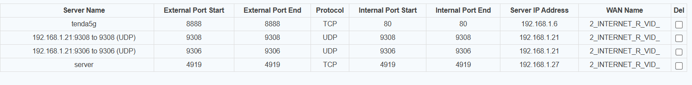
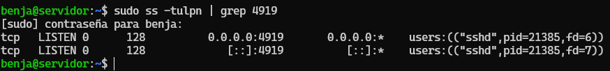

# Situación Actual

Se desea acceder a un servidor Linux dentro de la red local mediante SSH desde Internet. El servidor tiene:

IP local: 192.168.1.27
Puerto SSH configurado: 4919
Internet WAN pública reportada: 186.5.236.254

# 🌐 Configuración en el Router (Port Forwarding)

Se creó la siguiente regla de redirección de puertos:

| Servicio | Puerto externo | Puerto interno | IP destino   | Protocolo |
| -------- | -------------- | -------------- | ------------ | --------- |
| SSH      | 4919           | 4919           | 192.168.1.27 | TCP       |

---

# El servidor confirma que el servicio SSH está activo en el puerto 4919:

```bash
sudo ss -tulpn | grep 4919
tcp LISTEN 0 128 0.0.0.0:4919
tcp LISTEN 0 128 [::]:4919
```

# Pruebas Externas con Nmap

```bash
nmap -p 4919 -Pn 186.5.236.254
```

```psql
Host is up.
PORT     STATE    SERVICE
4919/tcp filtered unknown
```

=> El estado filtered indica que el puerto:

- No está accesible desde Internet

- Está siendo bloqueado por un firewall intermedio

Esto puede deberse a:

🟥 1. El ISP bloquea puertos entrantes

Muchos proveedores residenciales no permiten recibir conexiones desde Internet, a menos que se pague IP pública desbloqueada.

🟧 2. El router tiene firewall adicional bloqueando el tráfico

Posibilidad menos probable, ya que la redirección ya fue configurada correctamente.

🟨 3. Existe CG-NAT (Carrier Grade NAT)

Si la IP WAN del router no coincide con 186.5.236.254, entonces no hay IP pública real

entonces

# Bloqueo por Firewall/ISP Detectado

Al intentar acceder desde Internet mediante SSH:

```bash
ssh -p 4919 benja@186.5.236.254
```

La conexión falla con:

ssh: connect to host 186.5.236.254 port 4919: Connection timed out

Además, la IP pública tampoco responde a ICMP (ping):

ping 186.5.236.254

56 packets transmitted, 0 received, 100% packet loss

A pesar de disponer de una IP pública estática, el puerto 4919 (y el ping) aparecen como “filtered” en Nmap, lo cual indica:

🛑 Existe un firewall externo, probablemente del proveedor de Internet (ISP), bloqueando el acceso entrante.

=> No soy técnico pero es lo que me he informado, tengo todo configurado como me solicitaron,





### resume

1️⃣ Qué tienes

Servidor interno (LAN)

IP: 192.168.1.27

SSH configurado en puerto: 4919

Firewall del servidor (UFW) permite conexiones en ese puerto ✅

Prueba interna (nc) funciona → el servidor responde dentro de la LAN ✅

Router Tenda

LAN: 192.168.1.1

WAN: 10.239.88.2 (PPPoE)

IP pública visible en Internet: 186.5.236.254

Virtual Server / Port Forwarding configurado:

server: 4919 → 4919 → 192.168.1.27 → TCP

server2: 443 → 4919 → 192.168.1.27 → TCP

Bind Port: LAN1-LAN4 + SSID1 ✅

ISP

Afirman que tienes IP pública estática y puertos abiertos ✅

2️⃣ Qué sucede

Pruebas externas (desde Internet o datos móviles):

ssh -p 4919 usuario@186.5.236.254 → timeout

ssh -p 443 usuario@186.5.236.254 → timeout

Interpretación:

Servidor y LAN funcionan → el problema no está dentro de tu red local

Reglas de Virtual Server y Bind Port están correctas → el router debería reenviar el tráfico

Pero los paquetes no llegan al servidor desde Internet

3️⃣ Posibles causas

Firewall del router bloqueando tráfico WAN a puertos no estándar

Aunque tengas port forwarding y Bind Port correctos, muchos routers Tenda bloquean tráfico externo a puertos altos o a 443 si no está explícitamente habilitado.

NAT interno / PPPoE / IP privada del router

Tu router tiene IP WAN 10.x.x.x, aunque el ISP dice que la IP pública está abierta. Puede haber NAT interno que impide la conexión.

Prueba desde dentro de la LAN no funciona

NAT loopback no permite probar usando la IP pública desde la misma red, pero tus pruebas con datos móviles confirman que el tráfico WAN no llega.

4️⃣ Conclusión resumida

Todo interno funciona ✅

Port forwarding y Bind Port están correctos ✅

Tráfico externo no llega al servidor ❌

Causas más probables: firewall del router o NAT interno (no es el servidor ni UFW)


# 

sudo ufw status

```
nc -vz 192.168.1.27 4919
# Output: succeeded!
```

estoy dentro de un cgnat cgnat